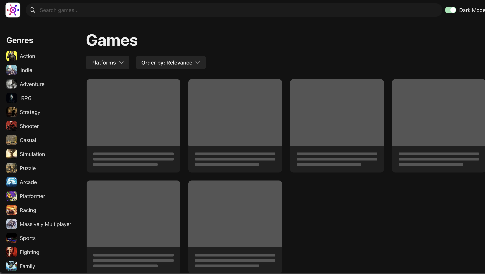
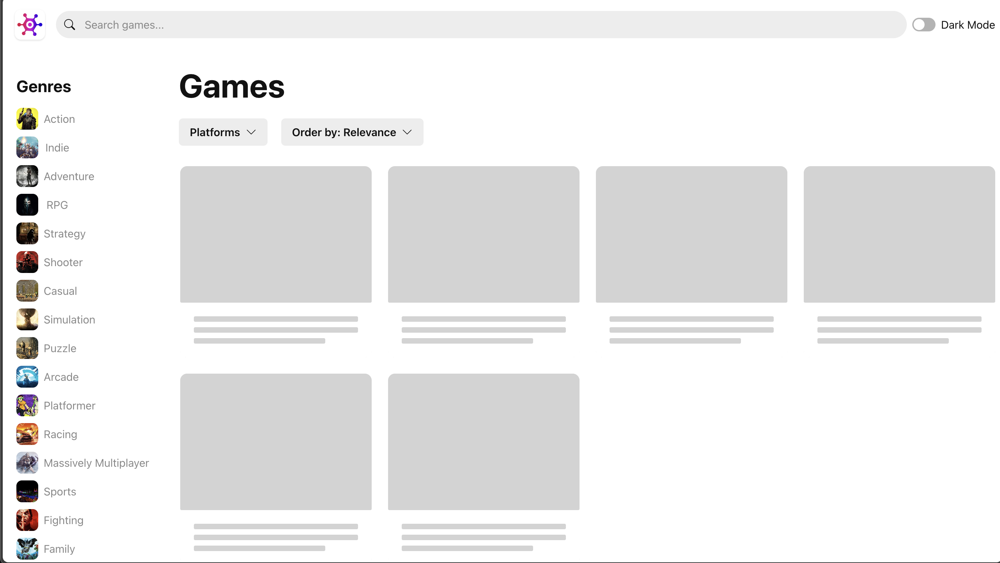
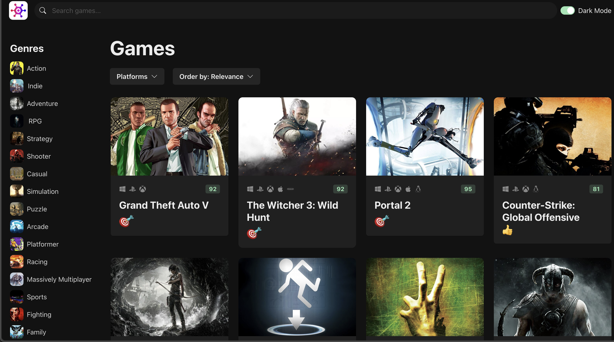
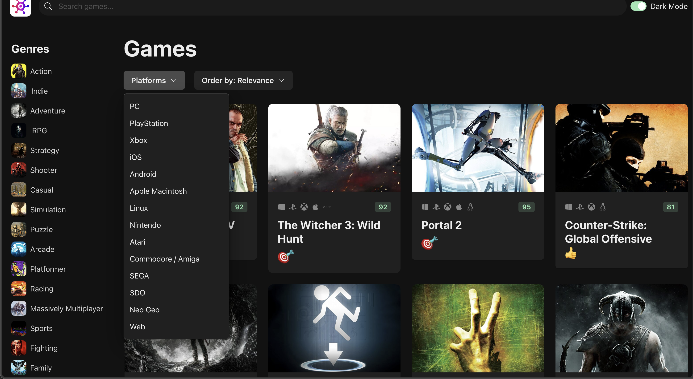
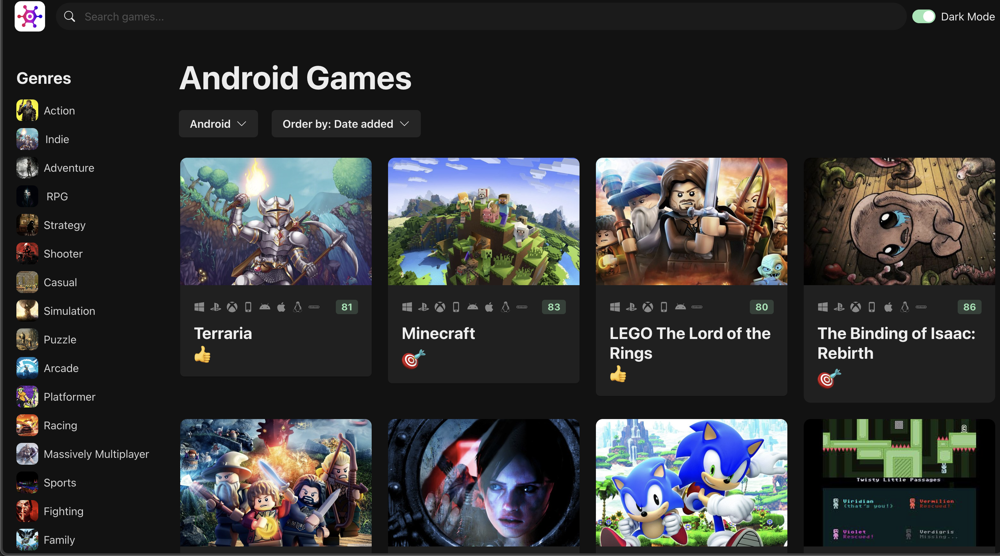
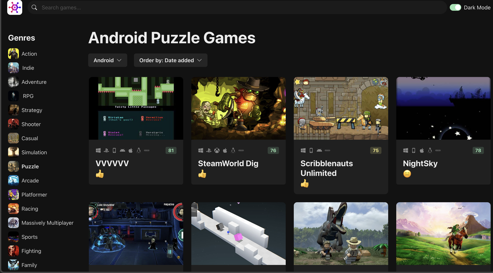
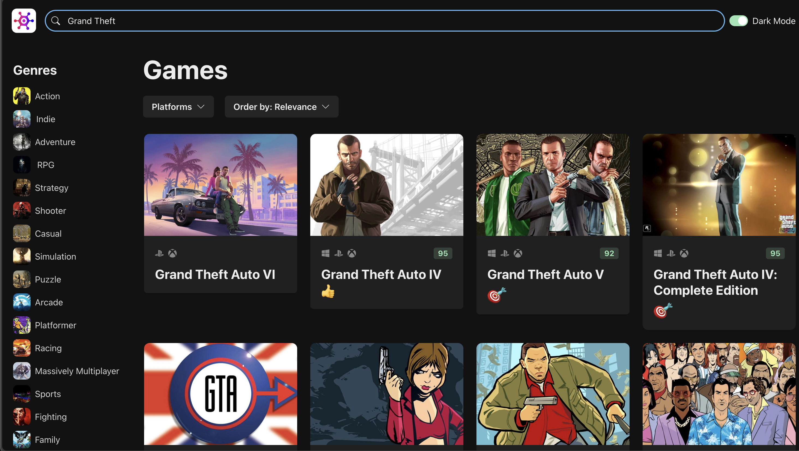

# React-Learning

React-Learning is a React + TypeScript learning project built with Vite. The main app is a game discovery UI inspired by the RAWG game browser style and the React course workflow by Mosh.

## Screenshots

<p align="center">
  
  
</p>

<p align="center">
  
  
</p>

<p align="center">
  
  
  
</p>

## Features

- React 18 app built with Vite and TypeScript.
- Chakra UI layout and components.
- Dark mode toggle.
- Responsive grid layout for game cards.
- Game list fetched from the RAWG API.
- Search by game title.
- Filter by genre.
- Filter by platform.
- Sort by relevance, date added, name, release date, popularity, and average rating.
- Platform icon list using `react-icons`.
- Critic score badge and rating emoji.
- Skeleton cards while data is loading.
- Cropped game image helper with fallback placeholder.
- Static local genre/platform data used for filter menus.

## Tech Stack

- React
- TypeScript
- Vite
- Chakra UI
- Emotion
- Framer Motion
- Axios
- React Icons
- RAWG API

## Project Structure

```text
.
├── README.md
├── images/                  # README screenshots
├── package.json             # Root dependency file
└── react-app
    ├── package.json
    ├── vite.config.ts
    ├── index.html
    └── src
        ├── App.tsx
        ├── main.tsx
        ├── components       # Game cards, filters, navbar, search, sorting, dark mode
        ├── hooks            # useData, useGames, useGenres, usePlatforms
        ├── services         # Axios client and image URL helper
        ├── data             # Static genre/platform data
        ├── assets           # Logos, placeholders, rating images
        └── theme.ts
```

## Main Flow

1. `App.tsx` stores the current `GameQuery` state.
2. `NavBar` updates search text.
3. `GenreList`, `PlatformSelector`, and `SortSelector` update filters.
4. `GameGrid` calls `useGames(gameQuery)`.
5. `useGames` delegates to the generic `useData` hook.
6. `api-client.ts` sends requests to the RAWG API.
7. Game cards render image, platform icons, critic score, name, and rating emoji.

## API Configuration

The app uses RAWG API requests. For production or public projects, keep the API key in an environment variable instead of hardcoding it.

Example Vite environment variable:

```env
VITE_RAWG_API_KEY=your_rawg_api_key
```

## Getting Started

```bash
cd react-app
npm install
npm run dev
```

Then open the local Vite URL in your browser.

## Build

```bash
cd react-app
npm run build
```

## Notes

This is a learning project, so `node_modules` is currently present in the repository snapshot. In normal production repositories, dependencies should be installed from `package-lock.json` instead of committed.
